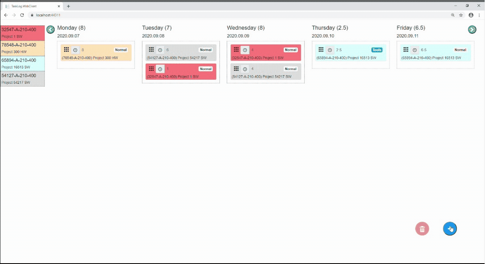

# Task Logger

A small web application to record my daily activities.
Made with C# and Blazor (Server Side)

I use this to track my daily tasks and create some reports for my work.

## Usage

1. Clone
2. `cd TaskLog\TaskLog.WebClient`
3. `dotnet build`
4. `dotnet run`
5. Open a webbrowser in the address showed in the console (default: `https://localhost:5001`)

## Features

- Allows to create a task (by pressing the + button)
- Allows to remove a task by dragging it to the trash
- Allows to assing the task a different job (left bar)
- Allows to move on the date, using the top left/right buttons
- New jobs are added to the jobs.json (yes, manually)

## Sample

## Pending

- Export to a csv file
- View/generate a report
- Have a month view
- Implement a state handling pattern (Currently it is just hacked there)
- Improve the UI design
- Implement a DB to stop using the json files (privacy, right)
- More on [issues](https://github.com/gabrieldelaparra/TaskLog/issues)
